# 스토리 보드

## 📒 [**노션 바로 가기**](https://silent-faucet-40c.notion.site/765f1afcd35045b3a60e59f159bac123)

### 📰 스토리보드(Diagram)

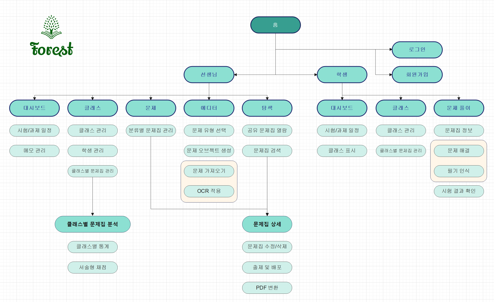

### 📖 선생님 페이지 - 대시보드

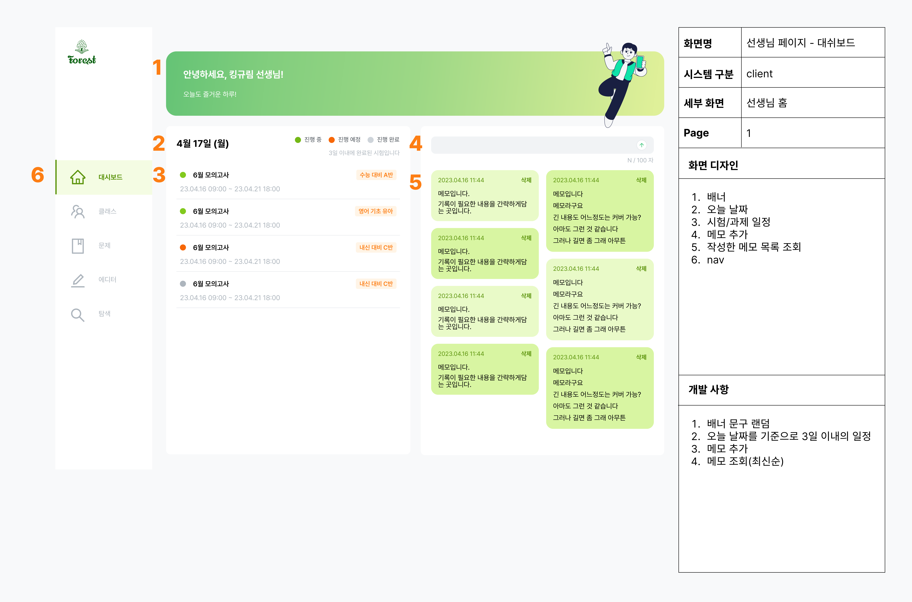

### 📖 선생님 페이지 - 클래스

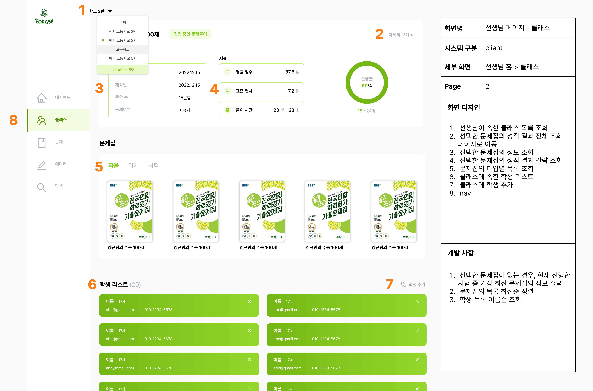

### 📖 선생님 페이지 - 문제

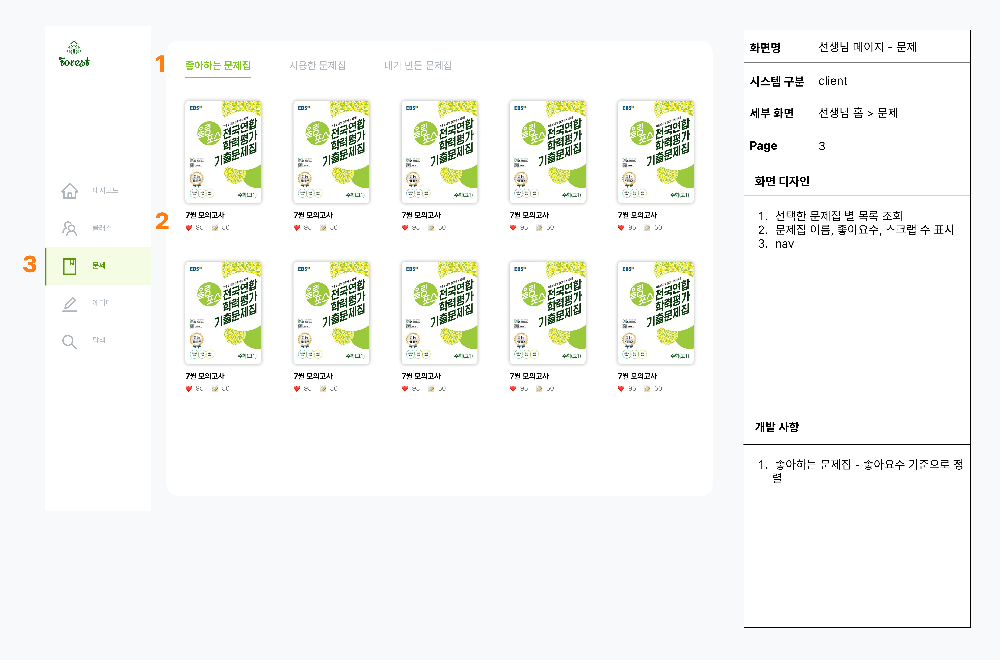

### 📖 선생님 페이지 - 에디터

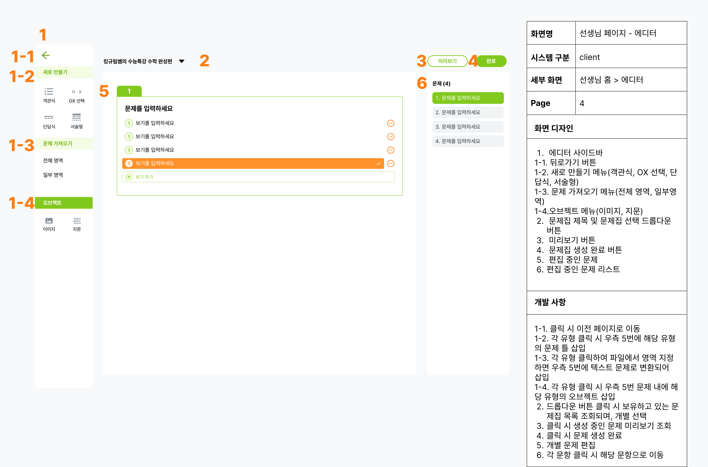

### 📖 선생님 페이지 - 에디터(가져오기)

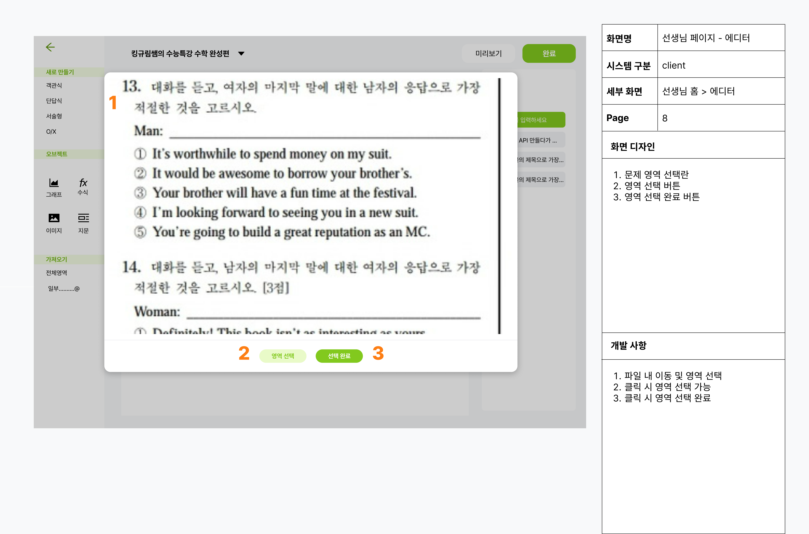

###

### 📖 선생님 클래스 - 탐색

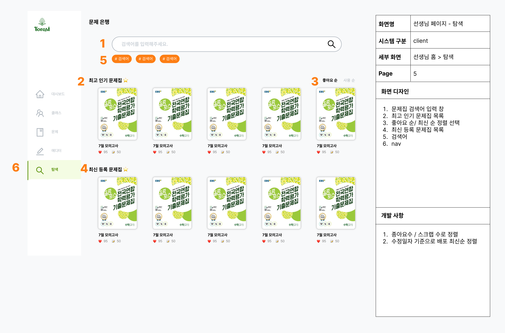

### 📖 선생님 페이지 - 문제집 상세

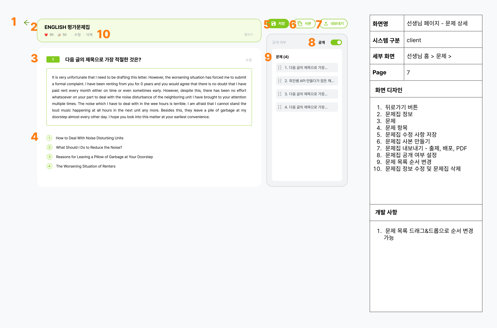

### 📖 선생님 페이지 - 문제집별 분석 그래프

### 📖 학생 페이지 - 대시보드

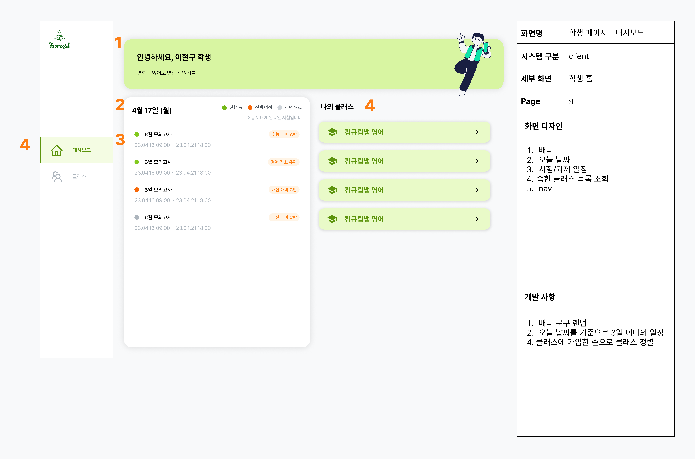

### 📖 학생 페이지 - 클래스

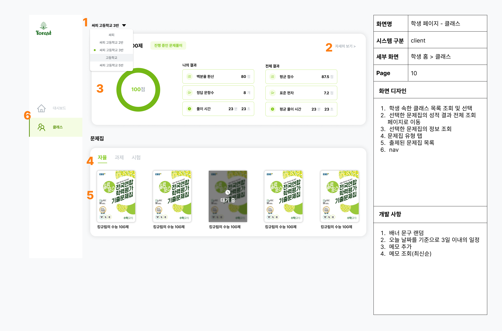

### 📖 학생 페이지 - 문제풀이 표지

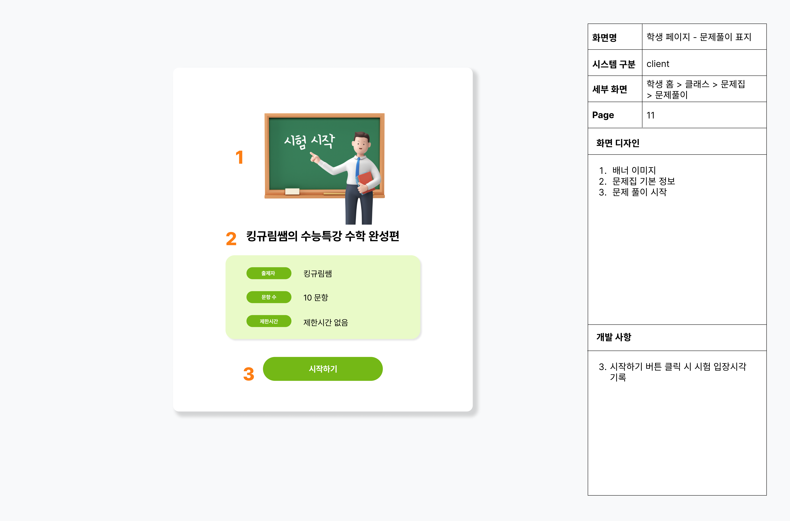

### 📖 학생 페이지 - 문제풀이

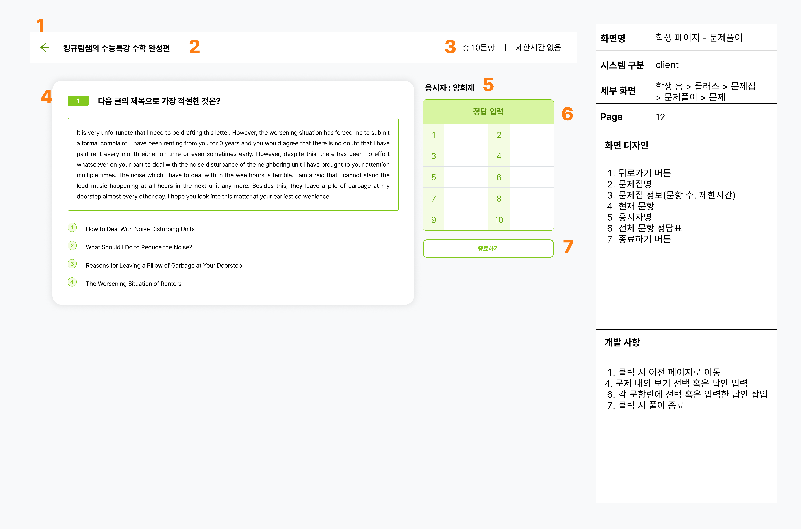

### 📖 학생 페이지 - 문제풀이 결과

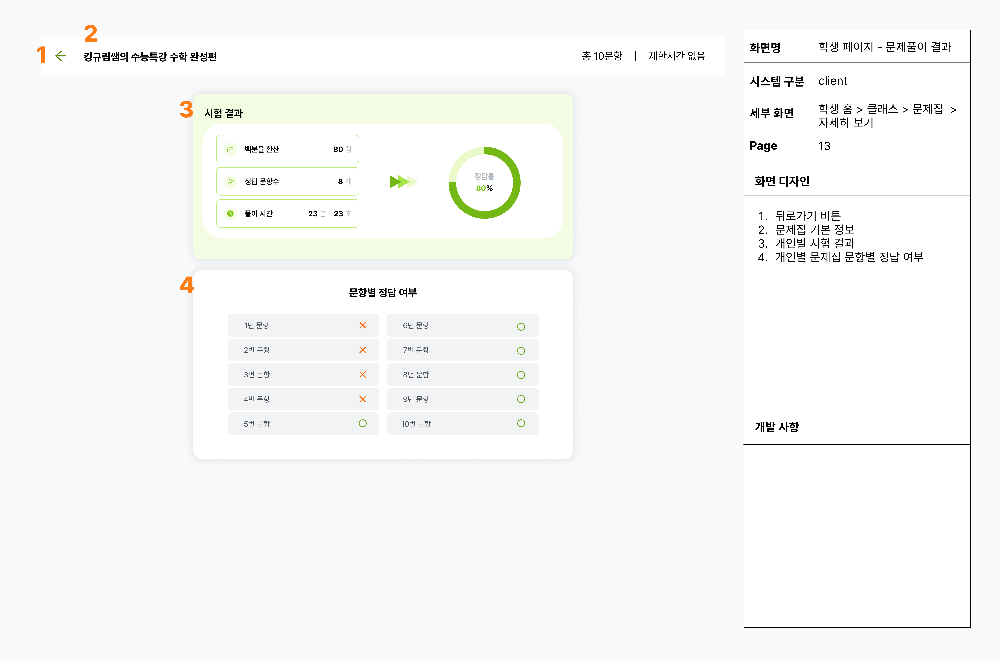
